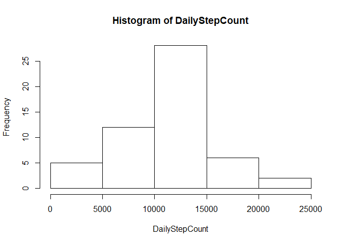
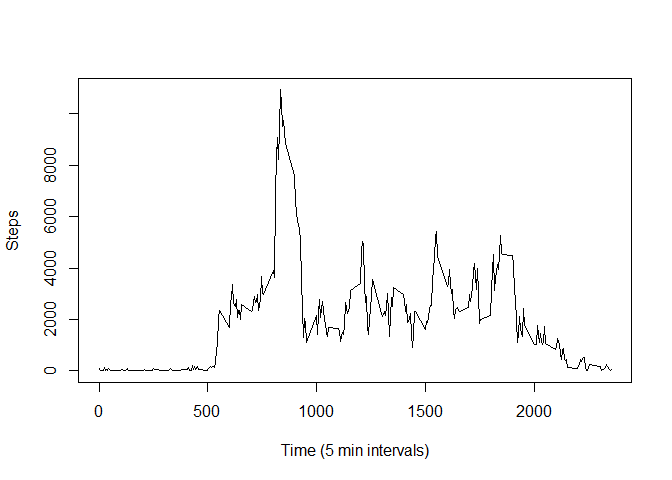
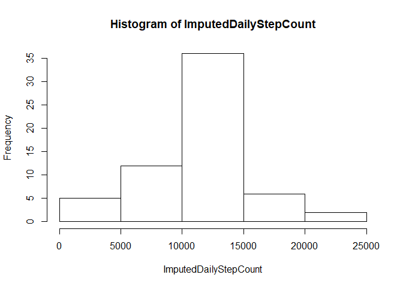
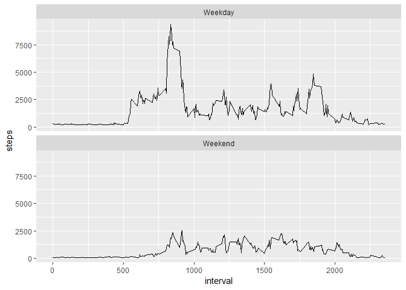

# Josh McNamara

## Loading and preprocessing the data


```r
# Point to project
setwd('C:/Users/Josh/OneDrive - Johns Hopkins University/coursera_data_science_program/05_reproducible_research/RepData_PeerAssessment1-master/')
# Read in data
df <- read.csv('activity.csv')

# Format dates
df$date <- strptime(df$date, format='%Y-%m-%d')
df$wk <- weekdays(df$date)
df$end <- 'Weekday'
df[(df$wk %in% c('Saturday', 'Sunday')),]$end <- 'Weekend'
df$end <- as.factor(df$end)
# df <- na.omit(df)
```


## What is mean total number of steps taken per day?


```r
daily_summaries <- aggregate(df$steps, by=list(Category=as.character(df$date)), FUN=sum)
daily_mean <- mean(daily_summaries$x, na.rm = TRUE)
daily_median <- median(daily_summaries$x, na.rm = TRUE)
paste('Daily mean step count is ' , as.integer(daily_mean), '.', sep = '')
```

```
## [1] "Daily mean step count is 10766."
```

```r
paste('Daily median step count is ' , as.integer(daily_median), '.', sep = '')
```

```
## [1] "Daily median step count is 10765."
```

```r
DailyStepCount <- daily_summaries$x
hist(DailyStepCount)
```

<!-- -->


## What is the average daily activity pattern?


```r
df2 <- na.omit(df)
activity_pattern <- aggregate(df2$steps, by=list(Category=(df2$interval)), FUN=sum, na.omit=TRUE)
activity_pattern <- na.omit(activity_pattern)
colnames(activity_pattern) <- c('interval', 'steps')

plot(x=activity_pattern$interval, y=activity_pattern$steps, type='l', ylab='Steps', xlab='Time (5 min intervals)')
```

<!-- -->

```r
max_int <- activity_pattern[which(activity_pattern$steps==max(activity_pattern$steps)),]$interval
paste('Subjects were maximally active in the ', max_int, 'th time interval.', sep='')
```

```
## [1] "Subjects were maximally active in the 835th time interval."
```


## Imputing missing values

```r
# Identify missing values
missing <- sum(is.na(df$steps))
paste('There are', missing, 'missing step values in the dataset.')
```

```
## [1] "There are 2304 missing step values in the dataset."
```

```r
# Fill missing timepoints with daily mean / # of 5 min intervals in a day
filler <- daily_mean/(24*60/5)
filled <- df
filled[is.na(df$steps),]$steps <- filler

# Summarize imputed data
filled_daily_summaries <- aggregate(filled$steps, by=list(Category=as.character(filled$date)), FUN=sum)
filled_daily_mean <- mean(filled_daily_summaries$x)
filled_daily_median <- median(filled_daily_summaries$x)
paste('Imputed daily mean step count is ' , as.integer(filled_daily_mean), '.', sep = '')
```

```
## [1] "Imputed daily mean step count is 10766."
```

```r
paste('Imputed daily median step count is ' , as.integer(filled_daily_median), '.', sep = '')
```

```
## [1] "Imputed daily median step count is 10766."
```

```r
ImputedDailyStepCount <- filled_daily_summaries$x
hist(ImputedDailyStepCount)
```

<!-- -->

```r
# Are the missing times evenly distributed throughout the day?
# hist(df[is.na(df),]$interval)
print('By design, the imputed data do not differ from the na.omit data.')
```

```
## [1] "By design, the imputed data do not differ from the na.omit data."
```
## Are there differences in activity patterns between weekdays and weekends?


```r
# Call weekends
filled$wk <- weekdays(filled$date)
filled$end <- 'Weekday'
filled[(filled$wk %in% c('Saturday', 'Sunday')),]$end <- 'Weekend'
filled$end <- as.factor(filled$end)
weeks <- filled[filled$end=='Weekday',]
weeks_int <- aggregate(weeks$steps, by=list(Category=weeks$interval), FUN=sum)
weeks_int$end <- "Weekday"
ends <- filled[filled$end=='Weekend',]
ends_int <- aggregate(ends$steps, by=list(Category=ends$interval), FUN=sum)
ends_int$end <- "Weekend"
totals <- rbind(weeks_int, ends_int)
totals$end <- as.factor(totals$end)
colnames(totals) <- c('interval', 'steps', 'end')
library(ggplot2)
ggplot(totals, aes(x=interval, y=steps)) +
    geom_line() +
    facet_wrap(facets = totals$end, nrow=2)
```

<!-- -->

```r
#ends <- aggregate(filled[filled$end=='Weekend',]$steps, by=list(Category=(filled$interval))
```


